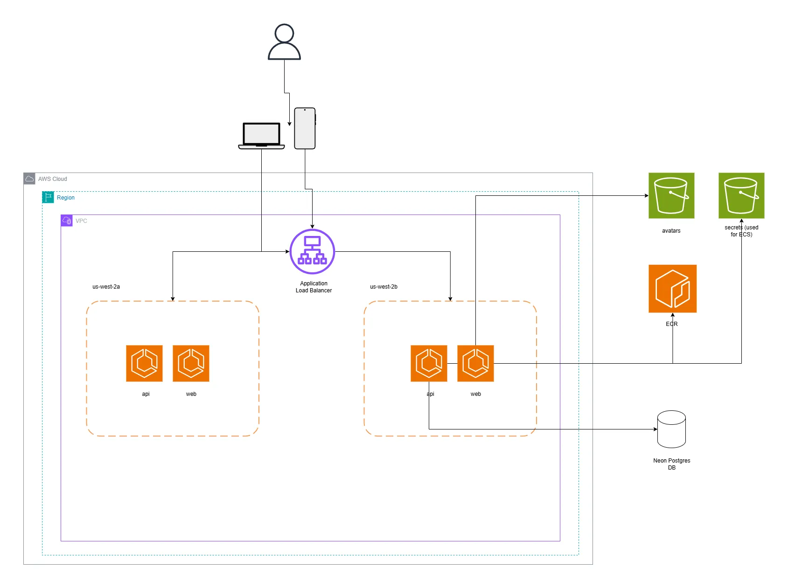

# Trail Tales Web API

This is the backend API for the **Trail Tales** app, built with modern technologies to support all app functionality including user authentication, game mechanics, and third-party integrations.

## Architecture



## Features

- **Fastify** web framework for fast and efficient HTTP services.
- **Prisma ORM** for robust and type-safe database access.
- **Authentication** using **JWT tokens** for secure login and protected routes.
- **Email notifications** powered by **Resend**.
- **Strava** integration for linking user fitness activity.
- Hourly cron jobs to advance user progression on the server.
- Fully containerized, ready for deployment with Docker.

## Getting Started

### Prerequisites

- Node.js 20+
- Yarn or npm
- A PostgreSQL-compatible database
- (Optional) Docker

### Environment Variables

- `DB_URL`: Database connection string
- `JWT_SECRET`: Secret key for signing JWT tokens
- `RESEND_API_KEY`: API key for Resend email service
- `STRAVA_CLIENT_ID`: Strava OAuth client ID
- `STRAVA_CLIENT_SECRET`: Strava OAuth client secret
- Any other app-specific settings

### Installation

```bash
git clone https://github.com/your-org/trail-tales-api.git
cd trail-tales-api
yarn install
```

### Development

1. Set up your `.env` file with the appropriate environment variables.
2. Generate Prisma client and run migrations:
    ```bash
    yarn migrate
    yarn generate
    yarn dev
    ```
3. Run the development server:
   ```bash
   yarn dev
   ```

### Run Tests
```bash
yarn test
yarn test:auth
yarn test:user
yarn test:game
yarn test:survival_day
```

### Build and Run Docker

Use Docker for testing deployment:

```bash
docker build -t trail-tales-api .
docker run -p 8080:8080 -d --name trail-tales-api --env-file .env trail-tales-api
```

## API Overview

The API supports endpoints for:

- **Authentication** (register, login, JWT issuance)
- **User profile and progression**
- **Game & session management**
- **Integration with Strava** for accessing user activity data
- **Admin/Moderation** (where applicable)

Explore API endpoints with [Swagger UI] or refer to the `/docs` endpoint (if enabled).

## Cron Jobs

The server runs an hourly cron job:
- Advances each user's **survival day** at midnight in their local time zone.

